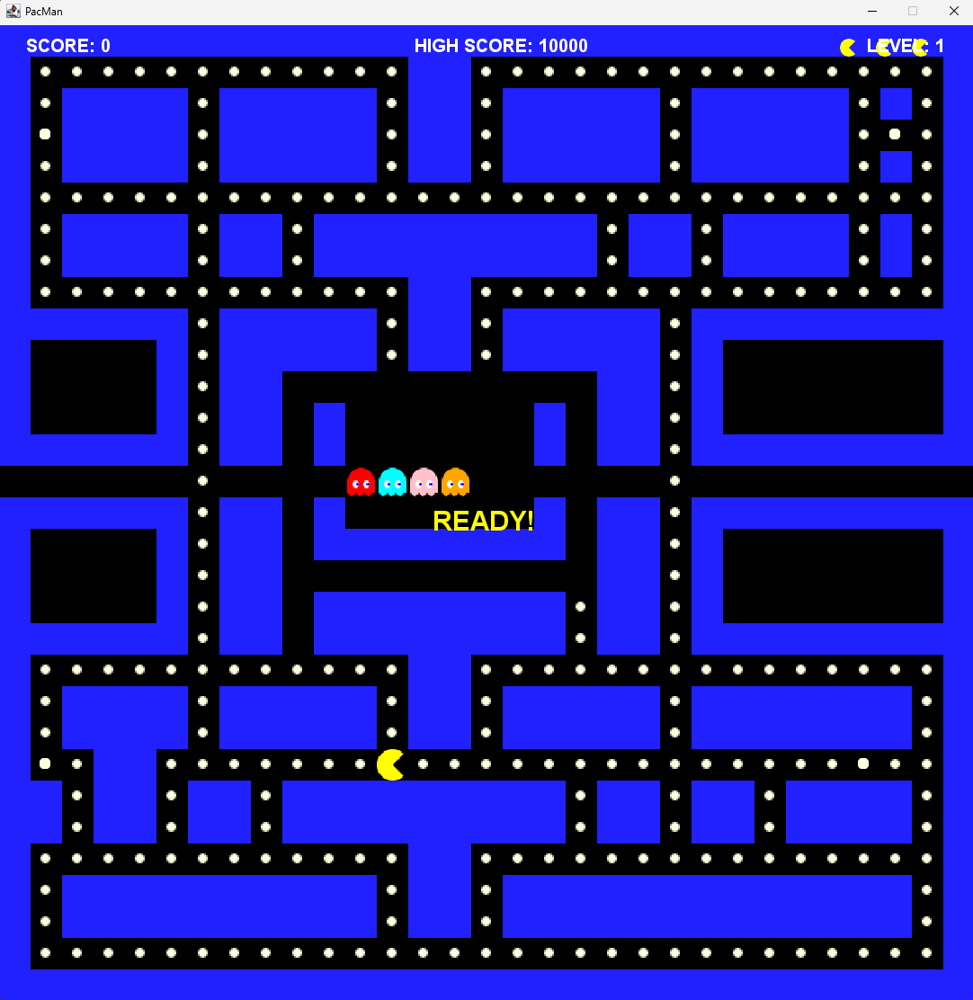

# PacMan Java

Ett klassiskt PacMan-spel implementerat i Java.

## Beskrivning

Detta är en implementation av det klassiska arkadspelet PacMan i Java. Spelet innehåller alla originalspelets funktioner, inklusive:

- Pacman-karaktär som spelaren kan styra
- Fyra spöken med olika beteenden och rörelsemönster
- Power-pellets som låter spelaren jaga spöken
- Poängsystem och liv
- Klassisk maze-layout

## Hur man spelar

1. Klona eller ladda ner detta repository
2. Kör `run_pacman.bat` för att kompilera och starta spelet
3. Använd piltangenterna för att styra Pacman

## Kontroller

- **Piltangenter**: Styr PacMan (upp, ner, vänster, höger)
- **P**: Pausa spelet
- **R**: Starta om nuvarande nivå

## Funktioner

- Fyra unika spöken med individuella beteendemönster
- Power-pellets som gör spöken sårbara
- Poängsystem
- Flera liv
- Möjlighet att anpassa banan (ändra i `tileMap` i `PacMan.java`)

## Utveckling

För att anpassa spelet:

1. Redigera `PacMan.java` för att ändra spellogik eller bana
2. Använd `run_pacman.bat` för att snabbt kompilera och testa dina ändringar

### Anpassa banan

Banan definieras i `tileMap`-arrayen i `PacMan.java`. Symbolerna är:

- `X` = vägg
- `o` = mat/prick
- `E` = power pellet
- ` ` (mellanslag) = tom yta
- `r` = rött spöke
- `b` = blått spöke
- `p` = rosa spöke
- `O` = orange spöke
- `P` = Pac-Man

## Skärmdump

För att se en skärmdump av spelet i aktion, se bilden i början av denna README.

*Placera din skärmdumpsfil i mappen `images` med namnet `pacman_screenshot.png`.*
